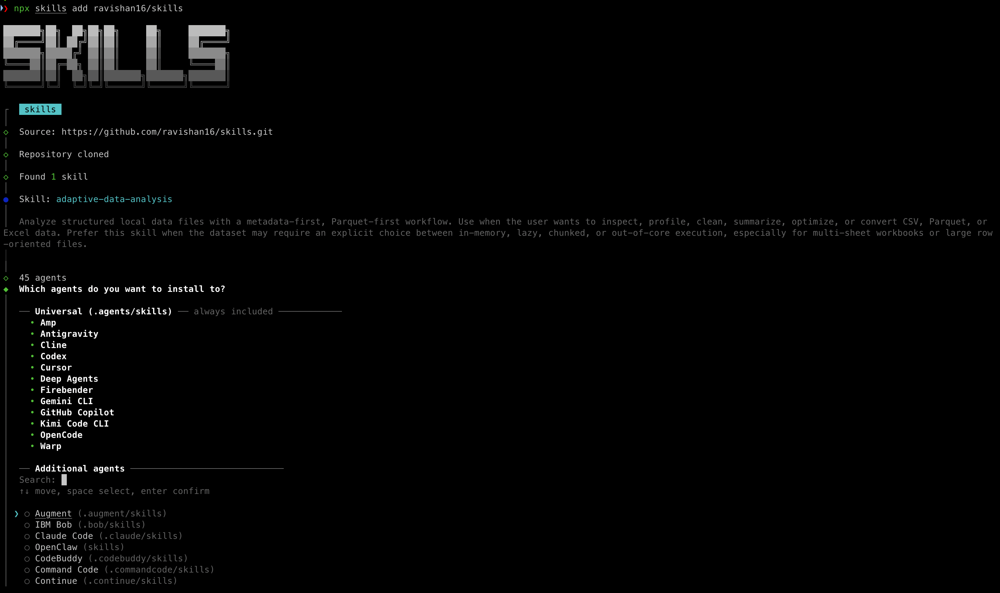
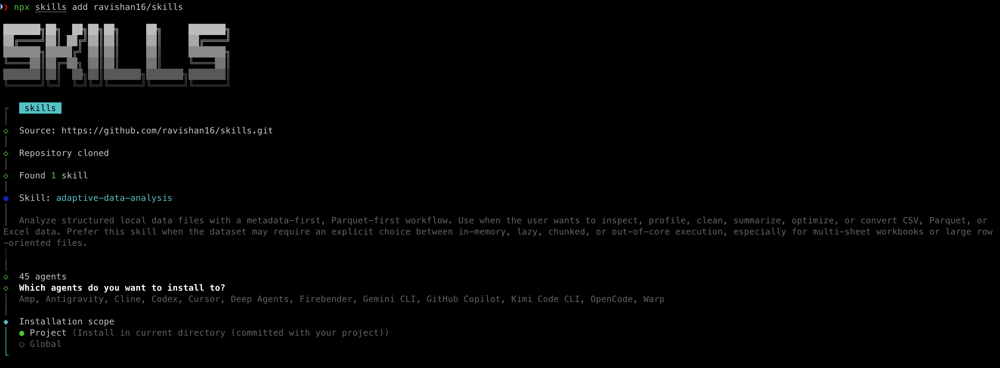
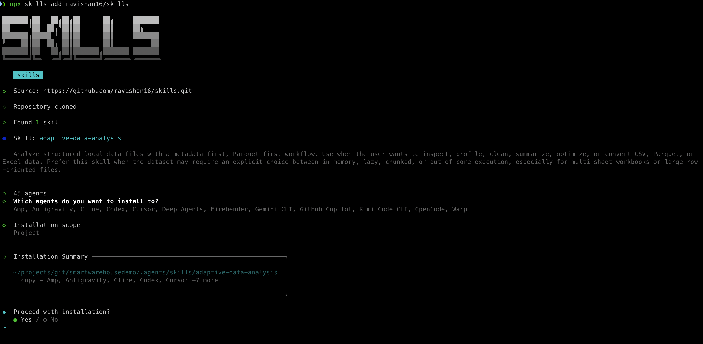
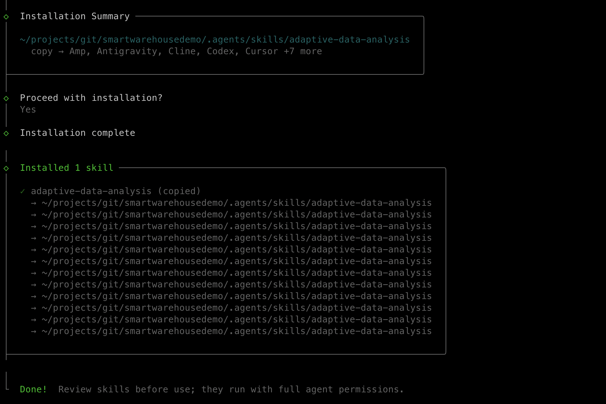

# skills

Open-source, contributor-friendly **agent skills** focused on structured data workflows.

The first skill in this repo is **`adaptive-data-analysis`**: a metadata-first, Parquet-first skill for **CSV**, **Parquet**, and **Excel (`.xlsx`)** that prefers **PyArrow + Polars + DuckDB** over Pandas-heavy workflows and adapts its execution strategy to the data shape and environment.

**Author:** Ravishankar Sivasubramaniam

## Principles

1. **Structured-data first**: start with CSV, Parquet, and Excel before expanding into document extraction.
2. **Metadata before reads**: inspect schema, size, and workbook structure before choosing a strategy.
3. **Parquet-first normalization**: convert row-oriented inputs to optimized Parquet early when it improves performance.
4. **Explicit decision-making**: choose in-memory, lazy, chunked, or out-of-core execution deliberately.
5. **Contributor-friendly by default**: every skill should be easy to review, validate, extend, and publish.
6. **Refined from real runs**: improve skills with execution traces, corrections, and recurring gotchas.

## Repository layout

```text
.
├── .github/
├── docs/
├── scripts/
└── skills/
    ├── _template/
    └── adaptive-data-analysis/
```

## Current skills

| Skill | Status | Focus |
| --- | --- | --- |
| `adaptive-data-analysis` | Drafting | High-performance, metadata-driven analysis for CSV, Parquet, and Excel |

The `_template` directory is a local scaffold and is **not** intended to be installed as a skill.

## Development

Run the repo checks locally:

```bash
./scripts/validate_skill.sh
./scripts/lint_docs.sh
./scripts/run_evals.sh
```

Prepare an eval workspace or aggregate benchmark results:

```bash
python3 scripts/prepare_eval_workspace.py --skill-dir skills/adaptive-data-analysis
python3 scripts/aggregate_eval_results.py --iteration-dir adaptive-data-analysis-workspace/iteration-1
```

Package skills for release or marketplace smoke testing:

```bash
python3 scripts/package_skills.py --output-dir dist
```

## Contribution flow

1. Start from `skills/_template/`.
2. Keep scope tight and trigger text specific.
3. Add examples and evals with each skill.
4. Run the repo checks before opening a pull request.

See **`CONTRIBUTING.md`** for the authoring guide and **`docs/publishing.md`** for publish-readiness expectations.

## Install from skills.sh-compatible GitHub source

skills.sh does not require a separate publish API. Public GitHub repositories that follow the skill format can be installed directly:

```bash
npx skills add ravishan16/skills
```

This repository currently publishes **one installable skill**, so adding `ravishan16/skills` installs **`adaptive-data-analysis`**.

### Install walkthrough

The CLI flow below shows the expected experience when adding this repository as a skills source.

<table>
  <tr>
    <td width="50%" valign="top">
      <strong>1. Add the repository source</strong><br />
      Start by adding <code>ravishan16/skills</code> as a skills source from the CLI.
      <br /><br />
      
    </td>
    <td width="50%" valign="top">
      <strong>2. Review discovered skills</strong><br />
      The installer detects the published skill and shows the installable entry before selection.
      <br /><br />
      
    </td>
  </tr>
  <tr>
    <td width="50%" valign="top">
      <strong>3. Choose target agents</strong><br />
      Select the agent directories where the skill should be installed.
      <br /><br />
      
    </td>
    <td width="50%" valign="top">
      <strong>4. Confirm the installed skill</strong><br />
      After installation, the CLI reports the completed setup for the selected agent environments.
      <br /><br />
      
    </td>
  </tr>
</table>

## Roadmap

- Finish the first release of `adaptive-data-analysis`
- Add evals and benchmark baselines
- Add publish-ready metadata and workflow checks
- Refine skills with real-task feedback and richer gotchas/reference material
- Explore follow-on structured-data skills before expanding into PDF extraction
